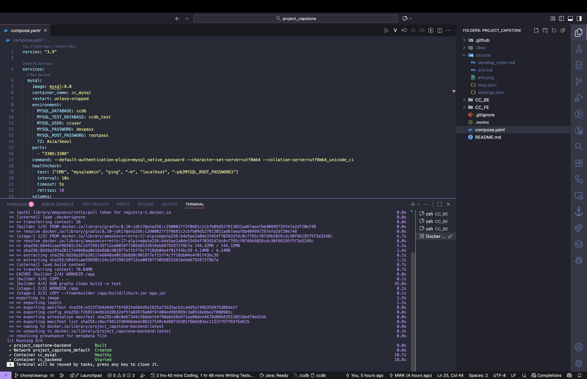

# Capstone Project

공동 캡스톤 프로젝트로 식단 기록, 공유, 추천 및 커뮤니티 기능을 통합 제공하는 플랫폼입니다. (이 문서는 BE + FE 전체 관점 README이며, 기술 스택이 확정되지 않은 부분은 이후 채워 넣을 예정입니다.)

---

1. docker compose 실행 후 
2. swaggerUI
   혹은 [postman](https://web.postman.co/workspace/My-Workspace~78fa8ea8-b9e6-4499-8386-848952566b31/collection/41646314-8ca7d4f0-1d1e-47c0-955d-9a3dc11e13a4?action=share&source=copy-link&creator=41646314)
   사용해서 api 테스트

---

## 1. 프로젝트 개요 (Overview)

사용자는 식단을 기록(다이어리), 식재료/냉장고 상태를 관리하고, 이에 맞는 레시피 및 쇼핑 정보를 탐색·추천받으며 커뮤니티에서 소통할 수 있습니다. 추가로 Q&A 전문가 시스템, 게시판 관리자 선거, 알림/검색 등
확장형 기능을 포함합니다.

---

## 2. 아키텍처 (Architecture)

---

## 3. 기술 스택 (Technology Stack)

### Frontend

| 항목               | 선택                  | 비고                     |
|------------------|---------------------|------------------------|
| Language         | TypeScript          |                        |
| Framework        | React 19            | Vite 7, React Compiler |
| State Management | TanStack Query v5   | 서버 상태 관리               |
| Routing          | React Router DOM v7 | Data Router            |
| Styling          | Tailwind CSS v4     | 유틸리티 우선 CSS            |
| Build Tool       | Vite                |                        |
| Package Manager  | pnpm                |                        |

### Backend

| 항목              | 선택                | 비고                |
|-----------------|-------------------|-------------------|
| Language        | Java 17           |                   |
| Framework       | Spring Boot 3.5.6 | build.gradle 기준   |
| Persistence     | Spring Data JPA   |                   |
| DB (Prod, Test) | MySQL 8.0         | Docker compose 사용 |

## 3-1. 개발 환경 (Docker Compose)

- 모든 서비스(DB, 백엔드, 프론트엔드)는 프로젝트 루트의 `compose.yaml`에서 통합 관리합니다.
- 백엔드(Spring Boot)는 멀티스테이지 Dockerfile로 빌드/실행됩니다.
- 프론트엔드는 추후 Dockerfile 추가 예정입니다.

### 개발/실행 방법

#### 1) DB만 컨테이너로 띄우고 백엔드는 로컬에서 개발

```bash
docker compose up -d mysql
# IntelliJ 등에서 ./gradlew bootRun
```

#### 2) FE/BE/DB 전체 컨테이너로 실행(통합/시연/배포)

```bash
docker compose up --build
```

#### 3) 서비스 중지/초기화

```bash
docker compose down
docker compose down -v  # 데이터까지 초기화
```

### 주요 환경 변수

#### 기본 환경 변수

- DB: ccdb / ccuser / devpass / rootpass
- 백엔드 포트: 8080
- 프론트엔드 포트: 3000

#### 영수증 분석 (Gemini Vision 기반)

영수증 이미지를 업로드하여 식재료 (name, quantity, unit)만 추출하는 기능을 사용하려면 아래 환경 변수를 설정합니다.

```bash
# Gemini API
export GEMINI_API_KEY="your-gemini-key"            # 로컬 개발 시 시스템 환경변수 또는 .env
export GEMINI_MODEL="gemini-1.5-flash"             # 기본값
export GEMINI_MAX_TOKENS="800"                     # 최대 출력 토큰 (필요 시 조정)
export GEMINI_API_URL="https://generativelanguage.googleapis.com/v1beta/models"
```

Docker Compose 사용 시 루트 `.env` 파일에 위 값을 넣고 `docker compose up --build` 실행하면 됩니다.

#### 쇼핑몰 상품 검색 (네이버 쇼핑 API 기반)

네이버 쇼핑 API를 통해 실시간 상품 데이터를 검색하고 Elasticsearch에 저장합니다.

```bash
# 네이버 쇼핑 API
export NAVER_CLIENT_ID="your-client-id"            # 네이버 개발자 센터에서 발급
export NAVER_CLIENT_SECRET="your-client-secret"    # 네이버 개발자 센터에서 발급
```

**API 키 발급**:
1. [네이버 개발자 센터](https://developers.naver.com/apps/#/register) 접속
2. 애플리케이션 등록 → 검색 API 선택
3. Client ID와 Client Secret 발급

**동작 요약**:
1. 카테고리별로 네이버 쇼핑 API를 호출하여 상품 데이터 수집
2. Elasticsearch에 인덱싱하여 빠른 검색 제공
3. 실시간 가격, 이미지, 상품 정보 제공

**동작 요약**:

1. 프론트엔드에서 이미지 업로드 (JPG/PNG 권장, <= ~1MB 권장)
2. 백엔드 `GeminiService`가 Vision generateContent REST API 호출 (inline_data)
3. 모델이 JSON: `{ items:[{ name, quantity, unit }] }` 반환 → 사용자가 소비기한만 선택 후 추가
4. 일괄 추가 시 같은 이름 + 같은 소비기한(둘 다 null 포함)이면 수량을 합산, 소비기한 다르면 별도 항목으로 저장

**보안 권장**:

- API 키는 Git에 커밋하지 말고 환경변수(.env) 또는 배포 플랫폼의 secret 관리 기능 사용
- 서버 측에서만 호출 (브라우저에 직접 키 노출 금지)

### 자주 발생하는 이슈

- 3306 포트 충돌: 로컬 MySQL 중지 필요
- DB 초기화 지연: healthcheck 후 백엔드 기동

### 참고 (Swagger UI 확인)

http://localhost:8080/swagger-ui/index.html

JSON -> http://localhost:8080/v3/api-docs

### 백엔드 (IntelliJ에서 개발할 경우, 루트 디렉토리가 해당 github repo일 때)

- IntelliJ에서 직접 Gradle 프로젝트 추가해야 함.
  지금 열려 있는 IntelliJ 프로젝트에서:
    1. 메뉴 → File → New → Module from Existing Sources…
    2. CC_BE/build.gradle 파일 선택
    3. Import as Gradle Project 선택

→ 이렇게 하면 기존 프로젝트 안에 백엔드 모듈이 추가됨.

### Frontend 개발 환경 구성 가이드

#### 1) 사전 준비물 (Prerequisites)

- **Git**
- **Docker Desktop**: [공식 홈페이지](https://www.docker.com/products/docker-desktop/)에서 설치
- **nvm-windows**: [GitHub Releases](https://github.com/coreybutler/nvm-windows/releases)에서 `nvm-setup.zip` 다운로드 및 설치
- **pnpm**: `npm install -g pnpm` 명령어로 설치
- **VS Code** (권장): 아래 확장 프로그램 설치를 권장합니다.
    - `ESLint`
    - `Prettier - Code formatter`
    - `Tailwind CSS IntelliSense`

#### 2) 프로젝트 클론 및 초기 설정

```bash
# 1. 프로젝트를 클론합니다.
git clone [레포지토리 주소]

# 2. 프로젝트 루트 폴더로 이동합니다.
cd BE-FE

# 3. .nvmrc 파일에 명시된 Node.js 버전을 자동으로 설치 및 사용합니다.
nvm install
nvm use

# 4. pnpm 사용을 강제하는 corepack을 활성화합니다. (PC에서 최초 1회만 실행)
corepack enable

# 5. 프론트엔드 의존성 패키지를 설치합니다.
cd CC_FE
pnpm install
```

#### 3) 환경 변수 설정

프론트엔드 폴더(`CC_FE`)에서 `.env.example` 파일을 복사하여 `.env` 파일을 생성하고, 아래와 같이 환경 변수를 설정합니다.

```bash
# CC_FE/.env.example 파일을 복사하여 CC_FE/.env 파일 생성
# 아래 내용을 .env 파일에 입력

VITE_API_BASE_URL=http://localhost:8080
```

### 개발/실행 방법

#### A) 로컬 개발 모드 (FE는 로컬, BE/DB는 Docker)

> 프론트엔드 코드를 수정하며 바로바로 화면 변화를 확인하고 싶을 때 사용하는 가장 일반적인 방식입니다.

```bash
# 1. (프로젝트 루트에서) 백엔드와 DB만 Docker로 실행합니다.
docker compose up -d backend mysql

# 2. (별도의 터미널에서) 프론트엔드 개발 서버를 실행합니다.
cd CC_FE
pnpm dev
```

- **프론트엔드 접속**: `http://localhost:5173`
- **백엔드 API (Swagger)**: `http://localhost:8080/v3/api-docs`

#### B) 통합 실행 모드 (FE/BE/DB 전체 Docker)

> 전체 시스템이 통합적으로 잘 동작하는지 확인하거나, 실제 배포 환경과 유사하게 테스트하고 싶을 때 사용합니다.

```bash
# 1. (프로젝트 루트에서) 모든 서비스를 Docker로 빌드하고 실행합니다.
docker compose up --build
```

- **프론트엔드 접속**: `http://localhost:3000`
- **백엔드 API (Swagger)**: `http://localhost:8080/v3/api-docs`

#### C) 서비스 중지 및 초기화

```bash
# (프로젝트 루트에서) 모든 컨테이너를 중지하고 제거합니다.
docker compose down

# 컨테이너와 함께 데이터 볼륨(DB 데이터 등)까지 모두 삭제합니다.
docker compose down -v
```

---

## 4. 협업 (Collaboration)

### 역할 (people.md)

| 구분 | 인원            |
|----|---------------|
| FE | 김재훈, 나희성      |
| BE | 김준한, 김민우, 윤정환 |

### 브랜치 전략 (초안)

| 종류      | 네이밍          | 목적     |
|---------|--------------|--------|
| Main    | main         | 안정 배포  |
| Develop | develop (선택) | 통합 테스트 |
| Feature | feat/<scope> | 기능 개발  |
| Fix     | fix/<scope>  | 버그 수정  |
| Docs    | docs/<scope> | 문서     |

### 커밋 컨벤션 (제안)

`feat:`, `fix:`, `docs:`, `refactor:`, `test:`, `chore:`
